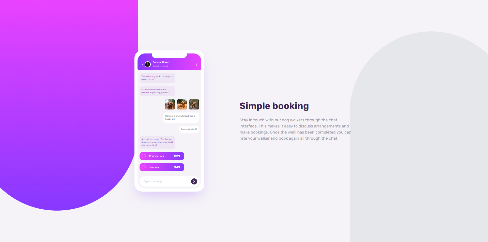

# Frontend Mentor - Chat app CSS illustration solution

This is a solution to the [Chat app CSS illustration challenge on Frontend Mentor](https://www.frontendmentor.io/challenges/chat-app-css-illustration-O5auMkFqY). Frontend Mentor challenges help you improve your coding skills by building realistic projects. 

## Table of contents

- [Overview](#overview)
  - [The challenge](#the-challenge)
  - [Screenshot](#screenshot)
  - [Links](#links)
- [My process](#my-process)
  - [Built with](#built-with)
  - [What I learned](#what-i-learned)
  - [Continued development](#continued-development)
  - [Useful resources](#useful-resources)
- [Author](#author)
- [Acknowledgments](#acknowledgments)

## Overview

### The challenge

Users should be able to:

- View the optimal layout for the component depending on their device's screen size
- **Bonus**: See the chat interface animate on the initial load

### Screenshot

### Desktop

### Mobile

### Links

- Solution URL: [Add solution URL here](https://github.com/RafaelSS427/chat-ilustration)
- Live Site URL: [Add live site URL here](https://rafaelss427.github.io/chat-ilustration/)

## My process

### Built with

- Flexbox
- CSS Grid
- Mobile-first workflow
- [framer-motion](https://www.framer.com/motion/) - Animation library
- [Next.js](https://nextjs.org/) - React framework
- [Tailwindcss](https://styled-components.com/) - For styles

### What I learned

I learned how to use tailwindcss in a basic way and improved my responsive design.

## Author

- Website - [Rafael Sequeira Sandoval](https://www.rafael-sequeira-sandoval.dev)
- Frontend Mentor - [@RafaelSS427](https://www.frontendmentor.io/profile/@RafaelSS427)